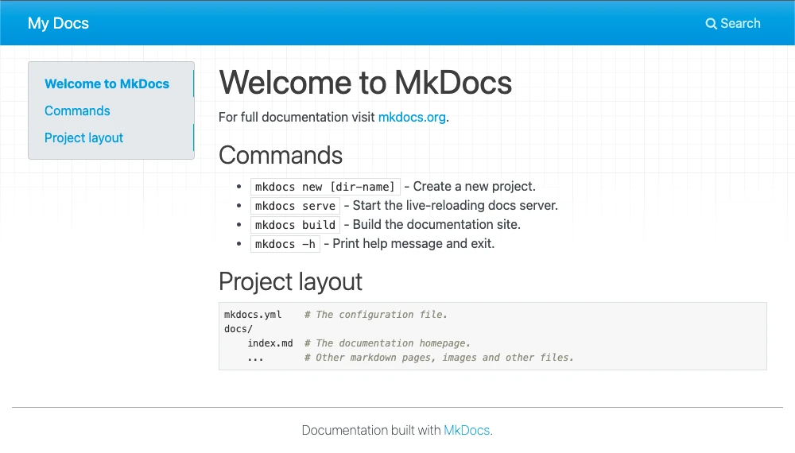

# {{ page.title }}

Pour créer votre premier site, créez un nouveau dossier et ouvrez une console dans ce répertoire.

!!! tip "Astuce"
    Si vous utilisez Visual Studio Code, vous pouvez ouvrir une console en tapant ++ctrl+shift+grave++ ou en cliquant sur le menu `Terminal` et en choisissant `New Terminal`.

    Si votre éditeur n'a pas de terminal intégré, nous vous recommandons d'utiliser [Windows Terminal](https://apps.microsoft.com/store/detail/windows-terminal/9N0DX20HK701) pour Windows, [iTerm2](https://iterm2.com/) pour macOS, ou le terminal par défaut de votre distribution Linux.

Créez maintenant un nouveau projet `Poetry`.

!!! tip "Astuce"
    `Poetry` crée un environnement virtuel Python quelque part dans votre système. Personnellement,
    je préfère que cet environnement soit créé dans le dossier `.venv` de mon projet.
    Pour cela, j'ai configuré `Poetry` avec la commande suivante :

    ```bash
    poetry config virtualenvs.in-project true
    ```

    A vous de voir si vous préférez cette option ou non.

Tapez la commande `poetry init` et répondez aux questions. N'ajoutez pas encore les
dépendances. Par exemple :

```text
This command will guide you through creating your pyproject.toml config.

Package name [mkdocs-edu-howto]:
Version [0.1.0]:
Description []:  Demo Web Site
Author [Jacques Supcik <jacques.supcik@hefr.ch>, n to skip]:
License []:  Apache-2
Compatible Python versions [^3.11]:

Would you like to define your main dependencies interactively? (yes/no) [yes] no
Would you like to define your development dependencies interactively? (yes/no) [yes] no
Generated file
...
Do you confirm generation? (yes/no) [yes]
```

Ajoutez maintenant les dépendances :

```bash
poetry add mkdocs mkdocs-material
```

Vous pouvez maintenant créer votre premier site mkdocs avec la commande suivante :

```bash
poetry run mkdocs new .
```

Mkdocs écrira ces quelques lignes dans la console :

```text
INFO     -  Building documentation...
INFO     -  Cleaning site directory
INFO     -  Documentation built in 0.03 seconds
INFO     -  [21:33:52] Watching paths for changes: 'docs', 'mkdocs.yml'
INFO     -  [21:33:52] Serving on http://127.0.0.1:8000/
WARNING  -  [21:33:52] "GET /mkdocs-edu-howto/first-site/ HTTP/1.1" code 404
INFO     -  [21:33:57] Browser connected: http://127.0.0.1:8000/
```

et en ouvrant votre navigateur à l'adresse [http://127.0.0.1:8000/](http://127.0.0.1:8000/),
vous devriez voir le résultat suivant :

{ class="screen" width="100%" }

Félicitations! Vous venez de créer un site web avec mkdocs.