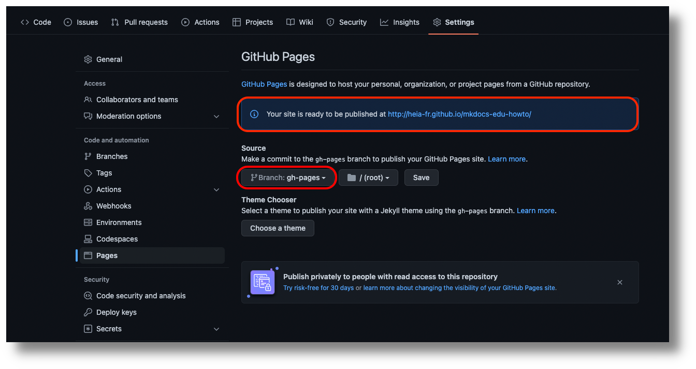

Pour rendre votre site disponible sur Internet, vous avez plusieurs solutions :

- [GitHub Pages](https://pages.github.com/)
- [GitLab Pages](https://docs.gitlab.com/ee/user/project/pages/)
- [Netlify](https://www.netlify.com/)
- [Vercel](https://vercel.com/)
- et bien d'autres encore...

Je vais décrire ici la méthode pour utiliser les _GitHub Pages_, mais toutes
les options ci-dessus sont possible avec MkDocs.

Pour utiliser _GitHub Pages_, vous devez héberger votre projet dans un dépôt git
de GitHub.

Créez ensuite un dossier `.github` à la racine de votre projet

Ajoutez-y les fichiers suivants pour définir l'action _Mkdocs edu builder_:

```yaml title="actions/mkdocs-edu/action.yml"
{! include "publishing/inc/actions/mkdocs-edu/action.yml" ignore missing !}
```

```Dockerfile title="actions/mkdocs-edu/Dockerfile"
{! include "publishing/inc/actions/mkdocs-edu/Dockerfile" ignore missing !}
```

```bash title="actions/mkdocs-edu/entrypoint.sh"
{! include "publishing/inc/actions/mkdocs-edu/entrypoint.sh" ignore missing !}
```

Ainsi que le fichier suivant pour le _workflow_ :

```yaml title="workflows/website.yml"
{! include "publishing/inc/workflows/website.yml" ignore missing !}
```

Lors du prochain _push_ avec ces nouveaux fichiers, l'action de github
créra une nouvelle branche avec le contenu de votre site statique.

Afin de publier cette branche dans _GitHub Pages_, allez dans _Settings_ --> _Pages_
et choisissez la branche _gh-pages_ comme source de votre site :

{ width="100%" }

Après avoir sauvé cette configuration, votre site devrait être publié
à l'adresse que vous pouvez voir sur la page des _settings_.

Grâce aux _GitHub Actions_, votre site sera automatiquement publié
lors de chaque _push_ de la branche _main_ du projet ou lors du
_push_ d'un _tag_ commençant par "v".