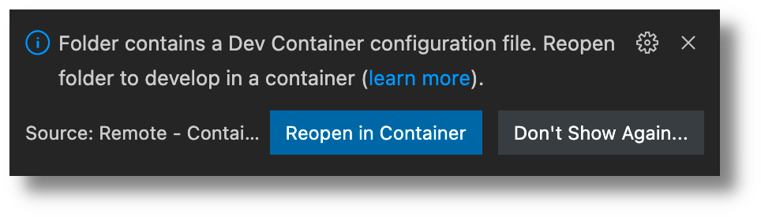

# Ouverture du dossier dans le _container_

Rouvrez le dossier de votre site dans le _devcontainer_. Vous avez plusieurs moyens de le faire:

1. Vous pouvez cliquer sur l'icône en bas à gauche de votre écran:
   
   et cliquez sur _Reopen in Container_.
2. Vous pouvez aussi ouvrir la palette de commande avec ++ctrl+shift+p++ ou ++cmd+shift+p++ et cherchez _Remote-Containers: Reopen in Container_. 
3. Vous pouvez enfin fermer l'éditeur et le rouvrir.
   VS Code vous proposera de le rouvrir dans un container:
    
   { width="75%" }

Vous savez que vous travaillez dans un container si en bas à gauche, la barre d'état de vs-code affiche le contenu suivant: 

Ouvrez un terminal dans vs-code et tapez la commande `mkdocs --version`. Vous devriez observer quelque chose comme ça: 

{ width="100%" }
